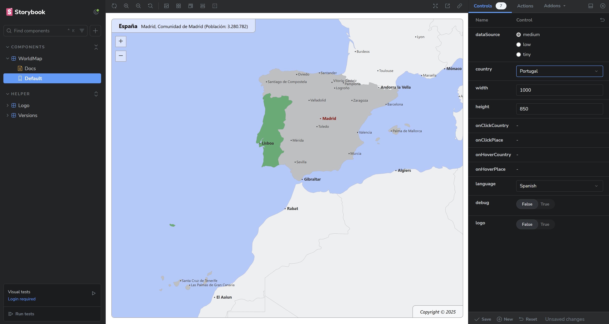

# @ixnode/geo-sphere

[](https://github.com/ixnode/node-geo-sphere/releases)
[](https://github.com/twelvepics-com/php-calendar-builder/releases)
[](https://www.npmjs.com/package/@ixnode/geo-sphere)
[](https://www.typescriptlang.org/docs/handbook/release-notes/typescript-4-9.html)
[](https://www.typescriptlang.org/docs/handbook/release-notes/typescript-4-9.html)
[](https://www.typescriptlang.org/docs/handbook/release-notes/typescript-4-9.html)
[](https://opensource.org/licenses/MIT)

`@ixnode/geo-sphere` is a powerful and flexible Node.js package for rendering interactive maps. It supports various
projections (_currently only Mercator projection - more are planned_), languages, and advanced interactivity, allowing
you to display geographical points and create a fully interactive mapping experience.

## 🚀 Features

* **Map Display**: Render world maps or other geographical maps in Mercator projection.
* **Point Rendering**: Display geographical points using latitude and longitude.
* **Resizable**: Dynamically adjust the map size to fit different screen dimensions.
* **Integrated Country Database**: Includes all countries with multiple resolution levels by default.
* **Interactive Countries**: Countries can be clicked, triggering a customizable callback function. Hover and title effects are also supported.
* **Multi-language Support**: Available in multiple languages: `cz`|`de`|`en`|`es`|`fr`|`hr`|`it`|`pl`|`sv`.
* **Mouse and Touch Interaction**: The map supports zooming and panning via mouse and touch gestures.
* **Lightweight** and built with TypeScript
* Build on top with [storybook](https://storybook.js.org/)

## 📦 Installation

```shell
npm install @ixnode/geo-sphere
```

or

```shell
yarn add @ixnode/geo-sphere
```

## 🔧 Usage

### Display example


### Basic Usage

```tsx
import React from 'react';
import { WorldMap } from '@ixnode/geo-sphere';
import '@ixnode/geo-sphere/dist/styles.css';

const App = () => (
    <WorldMap
        height={500}
        width={1000}
        country="de"
        language="en"
    />
);

export default App;
```

### Usage with callback function

```tsx
import React from 'react';
import { WorldMap } from '@ixnode/geo-sphere';
import '@ixnode/geo-sphere/dist/styles.css';
import {ClickCountryData} from "../config/interfaces";

const App = () => (
    <WorldMap
        height={500}
        width={1000}
        country="de"
        language="en"
        dataSource="medium"
        onClickCountry={(data: ClickCountryData) => { console.log(data); }}
    />
);

export default App;
```

## 🔧 Props

| Prop             | Type                                                                   | Default  | Description                      |
|------------------|------------------------------------------------------------------------|----------|----------------------------------|
| `dataSource`     | `'tiny'\|'low'\|'medium'`                                              | `'low'`  | The data source to be used.      |
| `country`        | `string\|null`                                                         | `null`   | The country that is marked.      |
| `width`          | `number`                                                               | `1000`   | The width of the map in pixels.  |
| `height`         | `number`                                                               | `500`    | The height of the map in pixels. |
| `language`       | `'cz'`\|`'de'`\|`'en'`\|`'es'`\|`'fr'`\|`'hr'`\|`'it'`\|`'pl'`\|`'sv'` | `'en'`   | The language to be used.         |
| `onClickCountry` | `(data: ClickCountryData) => void\|null`                               | `null`   | An optional click handler.       |

### Common countries (`country`)

Use `ISO 3166-1 alpha-2` code to select a country. Examples:

| Country                                              | ISO code |
|------------------------------------------------------|----------|
| United Kingdom of Great Britain and Northern Ireland | `gb`     |
| United States of America                             | `us`     |                       
| Germany                                              | `de`     |                                        
| Sweden                                               | `se`     |                                         
| etc.                                                 |                                      

See https://en.wikipedia.org/wiki/ISO_3166-1_alpha-2 for more information.

### Common languages (`language`)

Currently supported languages:

| Language | Description |
|----------|-------------|
| `cz`     | Czech       |
| `de`     | German      |
| `en`     | English     |
| `es`     | Spanish     |
| `fr`     | French      |
| `hr`     | Croatian    |
| `it`     | Italian     |
| `pl`     | Polish      |
| `sv`     | Swedish     |

## 🛠 Development

### Building the Project

To build the project locally:

```shell
npm run build
```

### Running Storybook

View and develop components in isolation:

```shell
npm run storybook
```

Open: http://localhost:6006/



## 📦 Publishing to npm

### Check TypeScript Code

* Runs the TypeScript compiler to detect errors without generating any JavaScript output
* Should not throw an error

```shell
npx tsc --noEmit
```

### Build the project

* Runs the build process to produce production-ready artifacts
* Test build for a future release process to npmjs.org
* Should not throw an error

```shell
npm run build
```

### Verify the build

* Checks that the compiled code runs as expected
* Should not throw an error

#### ES Modules build

```shell
node dist/index.js
```

or to ignore possible warnings:

```shell
node --no-warnings dist/index.js
```

#### CommonJS build

```shell
node dist/index.cjs
```

### Bump the version

Update the version in the package.json, e.g., from 1.0.0 to 1.0.1, to create a new release:

```shell
npm version patch
```

Alternatively:

* Use `npm version minor` for new features.
* Use `npm version major` for breaking changes.

### Publish the package

```shell
npm publish --access public
```

### Verify the publication

Check the package on npm: [https://www.npmjs.com/package/@ixnode/geo-sphere](https://www.npmjs.com/package/@ixnode/geo-sphere).

## 📄 License

This project is licensed under the MIT License. See the [LICENSE](LICENSE.md) file for details.

### Authors

* Björn Hempel <bjoern@hempel.li> - _Initial work_ - [https://github.com/bjoern-hempel](https://github.com/bjoern-hempel)

## 🌟 Contributing

Contributions are welcome! Feel free to submit issues or pull requests to improve this project.

## 🤝 Acknowledgments

Special thanks to the open-source community for providing amazing tools like React, TypeScript, and Storybook.
